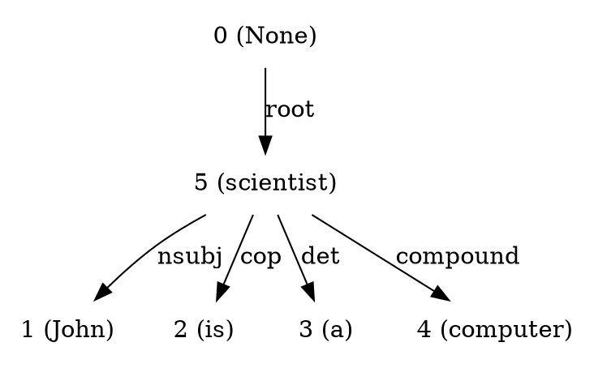

# Information Extraction

### Dependency Parsing

Understanding of Natural Language involves extraction of knowledge. The extraction of information from language can be done in many ways. Deep parsing is one such method which gives intra-sentence dependencies based on the model. Using Stanford parser, sentence level deep parsing is done in `ie_module` which can be used as follows. For more information and explanation about the code, refer [this article](put link).

First set up python environment, install dependencies using `requirements.txt`. Follow [this tutorial](put link).

Also set your own path of `stanford-parser` in file `SentenceProcessor.py` line number 10.

```python
from ie_module.SentenceProcessor import SentenceProcessor

s = SentenceProcessor('John is a computer scientist',1)
print s.get_parsed_graph()
s.save_dot_graph(s)
```

Gives the follwing output.



Also saves the graph image in the specified directory.


### Ngrams Finder

In a sentence, it is an important task to  find n-grams that makes sense together. Using POS tag pattern matching, we can solve this problem. Here is how `NgramsFinder` class can be used.

```python
from ie_module.NgramsFinder import NgramsFinder

n = NgramsFinder('John lives in the Great Britain')
print n.get_ngrams()
```

The output of the above would be,

```
[['Great', 'Britain']]
```
