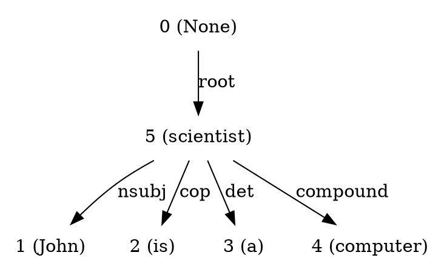
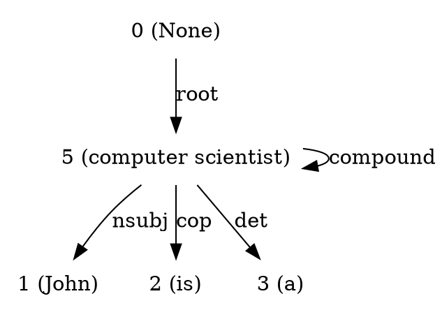

# Nelpy 

This repository contains different modules for performing Natural language processing(NLP) tasks in Python.

Following is the gist of each one of them. Check out individual `README.md`s for more.

### Dependency Parsing

Understanding of Natural Language involves extraction of knowledge. The extraction of information from language can be done in many ways. Deep parsing is one such method which gives intra-sentence dependencies based on the model. Using Stanford parser, sentence level deep parsing is done in `nelpy_module` which can be used as follows. For more information and explanation about the code, refer [this article](put link).

First set up python environment, install dependencies using `requirements.txt`. Follow [this tutorial](put link).

Note : To install `graphviz` and `pygraphviz` in ubuntu, run this command in order. (after activating virtual environment)

```
sudo apt install python-dev graphviz libgraphviz-dev pkg-config
pip install graphviz
pip install pygraphviz
```

Also set your own path of `stanford-parser` in file `SentenceProcessor.py` line number 10.

```python
from nelpy_module.SentenceProcessor import SentenceProcessor

s = SentenceProcessor('John is a computer scientist',1)
print s.get_parsed_dotgraph()
s.save_dot_graph(s)
```

Gives the follwing output.



Also saves the graph image in the specified directory.


### Ngrams Finder

In a sentence, it is an important task to  find n-grams that makes sense together (like 'Computer Scientist' or 'Great Britain'). Using POS tag pattern matching, we can solve this problem. Here is how `NgramsFinder` class can be used.

```python
from nelpy_module.NgramsFinder import NgramsFinder

n = NgramsFinder('John lives in the Great Britain')
print n.get_ngrams()
```

The output of the above would be,

```
[['Great', 'Britain']]
```

### Combine N-grams in a sentence

Once we have found out which Ngrams in a sentence are making sense together, we need to represent it a graph. So to make a `dot` formatted graph after combining the Ngrams of a sentence, following code can be used.

```python
from nelpy_module.SentenceProcessor import SentenceProcessor
s = SentenceProcessor('John is a computer scientist',1)
print s.get_merged_ngrams_dotgraph()
s.save_merged_ngrams_graph()
```

The output would be : 



And this image would be saved in the specified `filepath`


Note : The word with lesser references (low level in the dot tree, nearer to leave) gets replaced.  

### Combine many sentences by common nodes

